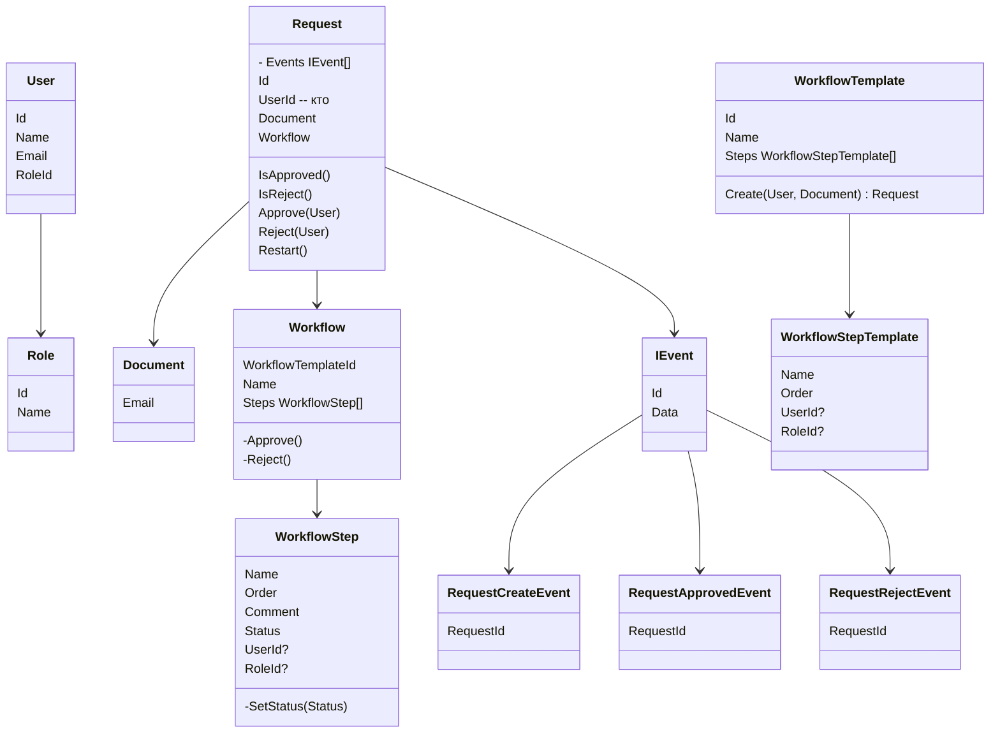

```mermaid
classDiagram
    User --> Role
    Request --> Document
    Request --> Workflow
    Request --> IEvent
    IEvent --> RequestCreateEvent
    IEvent --> RequestApprovedEvent
    IEvent --> RequestRejectEvent
    Workflow --> WorkflowStep
    WorkflowTemplate --> WorkflowStepTemplate

    class User{
        Id
        Name
        Email
        RoleId
    }
    class Role{
        Id
        Name
    }
    class Request{
        - Events IEvent[]
        Id
        UserId -- кто
        Document 
        Workflow
        IsApproved()
        IsReject()
        Approve(User)
        Reject(User)
        Restart()
    }
    class IEvent{
        Id
        Data
    }
    class RequestCreateEvent{
        RequestId
    }
    class RequestApprovedEvent{
        RequestId
    }
    class RequestRejectEvent{
        RequestId
    }
    class Document{
        Email
    }
    class Workflow{
        WorkflowTemplateId
        Name
        Steps WorkflowStep[]
        -Approve()
        -Reject()
    }
    class WorkflowStep{
        Name
        Order
        Comment
        Status
        UserId?
        RoleId?
        -SetStatus(Status)
    }
    class WorkflowTemplate{
        Id
        Name
        Steps WorkflowStepTemplate[]
        Create(User, Document) Request
    }

    class WorkflowStepTemplate{
        Name
        Order
        UserId?
        RoleId?
    }
```
