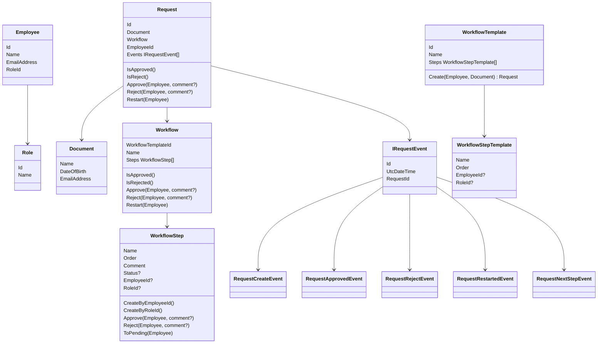

```mermaid
classDiagram
    Employee --> Role
    Request --> Document
    Request --> Workflow
    Request --> IRequestEvent
    IRequestEvent --> RequestCreateEvent
    IRequestEvent --> RequestApprovedEvent
    IRequestEvent --> RequestRejectEvent
    IRequestEvent --> RequestRestartedEvent
    IRequestEvent --> RequestNextStepEvent
    Workflow --> WorkflowStep
    WorkflowTemplate --> WorkflowStepTemplate

    class Employee{
        Id
        Name
        EmailAddress
        RoleId
    }
    class Role{
        Id
        Name
    }
    class Request{
        Id
        Document 
        Workflow
        EmployeeId
        Events IRequestEvent[]
        
        IsApproved()
        IsReject()
        Approve(Employee, comment?)
        Reject(Employee, comment?)
        Restart(Employee)
    }
    class IRequestEvent{
        Id
        UtcDateTime
        RequestId
    }
    class RequestCreateEvent{
    }
    class RequestApprovedEvent{
    }
    class RequestRejectEvent{
    }
    class RequestRestartedEvent{
    }
    class RequestNextStepEvent{
    }
    class Document{
        Name
        DateOfBirth
        EmailAddress
    }
    class Workflow{
        WorkflowTemplateId
        Name
        Steps WorkflowStep[]
        
        IsApproved()
        IsRejected()
        Approve(Employee, comment?)
        Reject(Employee, comment?)
        Restart(Employee)
    }
    class WorkflowStep{
        Name
        Order
        Comment
        Status?
        EmployeeId?
        RoleId?
        
        CreateByEmployeeId()
        CreateByRoleId()
        Approve(Employee, comment?)
        Reject(Employee, comment?)
        ToPending(Employee)
    }
    class WorkflowTemplate{
        Id
        Name
        Steps WorkflowStepTemplate[]
        Create(Employee, Document) Request
    }

    class WorkflowStepTemplate{
        Name
        Order
        EmployeeId?
        RoleId?
    }
```
