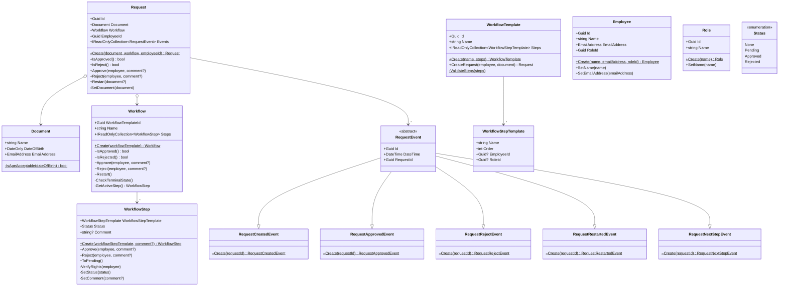

# Проект "Трекер резюме"

**Основная цель**: Разработать API для управления процессом найма новых сотрудников.

**Основные функции**:
1. Редактирование списка сотрудников и должностей.
2. Добавление анкеты кандидата с сохранением в базу данных.
3. Установка ряда заданий, которые должны быть выполнены кандидатом для получения должности.
4. Шаблоны с шагами для каждой должности.
5. Назначение куратора (сотрудника компании) для проверка каждого задания.
6. Возможность принятия, отклонения, перезапуска заявки кандидата.

**Платформа**: .NET 8.0.

## Диагарамма классов ([ссылка](https://mermaid.live/edit#pako:eNqtV1tv2jAU_iuR1Qe6hYpLoYAqKtZWVR_WToA6aeLFTQ6QNYmZ47RljPz22UlMnMRAVo2HJj3n-DsXn1s2yCI2oAGyXBwENw5eUOzNfIP_xvArhIAZpF4fGjfECj3wmYb1ndCXuUve8izBmaFPMyQpt6_F4zGFC_4ZSso1BczAriI6Wq0oea0mO4afYLFqkgHDtKIJD_DOJgxWiqyMheK-JAnJvNAUvJXL_d0jLNkzPzkW35Bxy4lkDbBJiOL3-S50bOPeVigBo46_MB6wBwr11sOOO7JtCjFQ9k8Ra0xcyOElF1PzOZ5pgHLSNGgse3qys0w5NgEmTIjPnebpqvqaipjKbVWnhT0fcVgxmxsoUA4bl1M6YZiFgaL28hJ8XgQUM4f4w2HGeCC-AvwNfJvbkhFkqmaUJCElJe9qkluHvZXVWCjLmLdLwXxdZkjynnKI92PA9qPvrq-J63LbuIeRmviRET-CcnDt1ATTeEsVigyRKkTYExhVWSBDUjs1nglxc7wkOGVOeqYmwU3DIp7QfKWmVnr6mFBc5jvbVWad54UM605Alx9SaHM0DW94nERsjfhl_sWhbPlvZVnnIVvAyLJgxfCzy6OeIfEQZ5HKWSgzoJRMxQ5UoZR0CaJ2q8gQfzX58VbQxc0V59y5mpnRgZSIZEroeJWSIqqSFJFMCjUXrpdgvUyBeo6PXdEQIMe-AzbioXgF4Ts3rtzrtfch2BtNyapdf88oyLpX3J3SJlW6vSvjOvFw_32ouEpATjRO_O9IT0naI3PBfALqzNdjZ7FkwQ6gUJiJu7UgfhR4qce1gkbtDUjHPzJUjlWCxN5bEckUDQRTCbfmjhP5tH8qMd11pXJvrT9h1xHNIdZdS5UcyUVdNPS-O3zmPFIbaCFuV_qpkrDUbUI36-LJkpuz-JmrxxZTh6xuDHKbp44Hhnwp7TGJgkPK1ZVTsSFK74pKhGyQlZdUHW5uP60GrFlpdcjKNlsNt7T-6lHVzbcqcHlb1mHnFuVq0JrdeotMxLcvPh9t_r0Sw8wQWwK_djTgrzbMceiyGZr5QhSHjEzWvoUGc-wGYKJwJeoi_cTZUVfYR4MNekeDbves3e-3zrutZqfXarSbJlqjQb3TP2t2Gt3zVrvfaTT7nfbWRL8J4QjNs4uLdrfba3b7vd5Fq9foxHA_YiajIUcH22GEfk0_scRj-xfn10S8))

